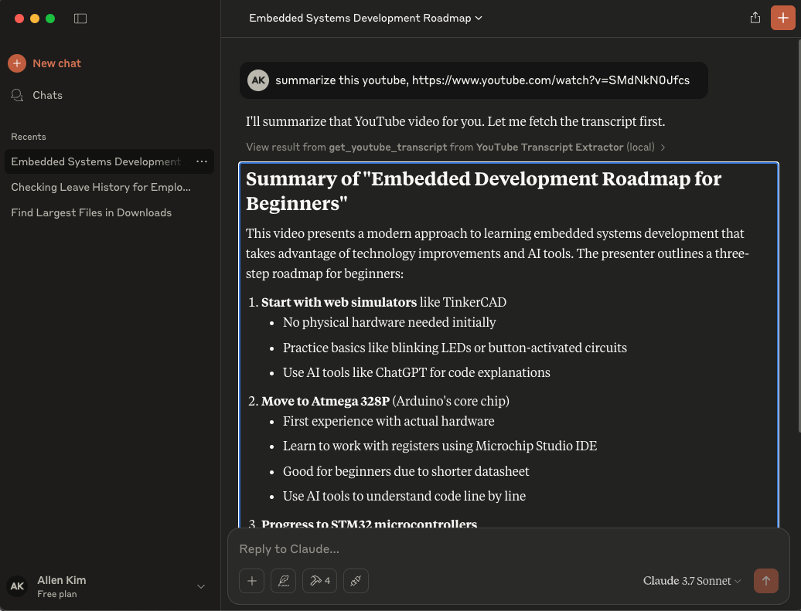

# mcp + youtube + Claude

```
$ uv add "mcp[cli]"
$ mcp dev main.py # to test with MCP inspector
$ mcp install main. # to install MCP to Claude desktop
```
After install your Claude `claude_desktop_config.json` will have this
```
{
  "mcpServers": {
    ...
    "YouTube Transcript Extractor": {
      "command": "uv",
      "args": [
        "run",
        "--with",
        "mcp[cli]",
        "--with",
        "youtube-transcript-api>=0.6.2",
        "mcp",
      ]
    }
  }
}
```

